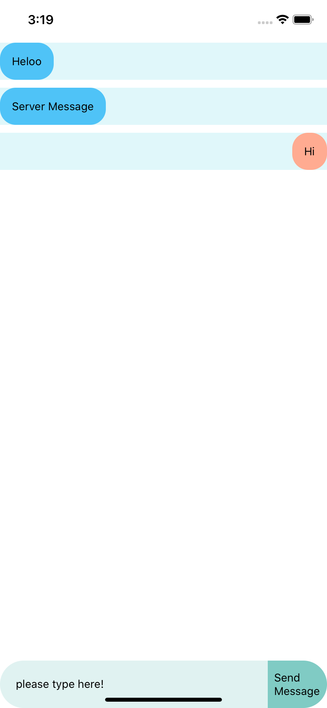

# ChatBubbleNPM

A simple and fully customizable React Native component that make chat screen

## Installation / Getting Started

```
yarn add @pravesh701/chatbubble
```
or

```
npm  install @pravesh701/chatbubble --save
```

### Prerequisites

These props must passed when used it <ChatBubble />

```
InputTextValue
MessageArray
sendMessageToServer
onChangeText
```


### Example

```
import React, { Component } from 'react';
import { StyleSheet, View } from 'react-native';
import ChatBubble from '@pravesh701/chatbubble';

export default class App extends Component {

  state = {
    //your message array
    messages: [
      {
        msg: 'Heloo',
        id: Math.random(),
        token: '',
        email: '',
        type: 'server',
      },
      {
        msg: 'Server Message',
        id: Math.random(),
        token: '',
        email: '',
        type: 'server',
      },
    ],
    //for textInput
    value: '',
  };

  /**
   * send mesaage to server via payload or whole array
   */
  _sendMethod = (myArray, payload) => {
    this.setState({
      messages: myArray,
      value: '',
    });
    console.log("Recieved Call for sending user messages")
  }
  /**
   * To change Input Text Value
   */
  _onChangeTextForSendMessage = (value) => {
    this.setState({
      value: value
    })
  }

  render() {
    return (
      <View style={styles.container}>
        <ChatBubble
          InputTextValue={this.state.value}
          MessageArray={this.state.messages}
          sendMessageToServer={this._sendMethod}
          onChangeText={this._onChangeTextForSendMessage}
        />
      </View>
    );
  }
}

const styles = StyleSheet.create({
  container: {
    flex: 1,
  },
});

```

## Contributing

Please read [Visit](https://github.com/Pravesh701/ChatBubbleNPM.git) for details on our code of conduct, and the process for submitting pull requests to us.


## Authors

* **Pravesh Singh** - *Initial work* - [Github](https://github.com/Pravesh701)


## License

This project is licensed under the MIT License - see the [LICENSE.md](LICENSE.md) file for details

## ScreenShots



## Acknowledgments

* Inspiration by react native chat bubble


